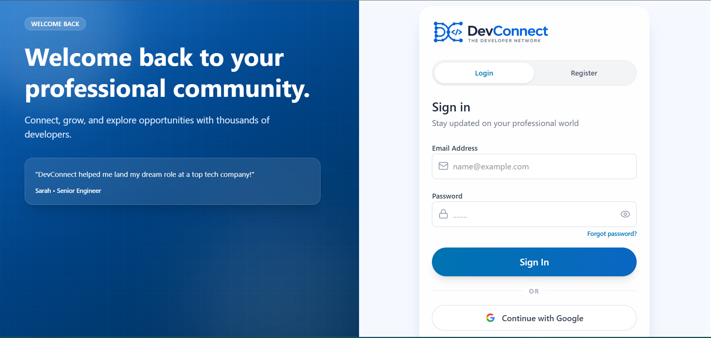
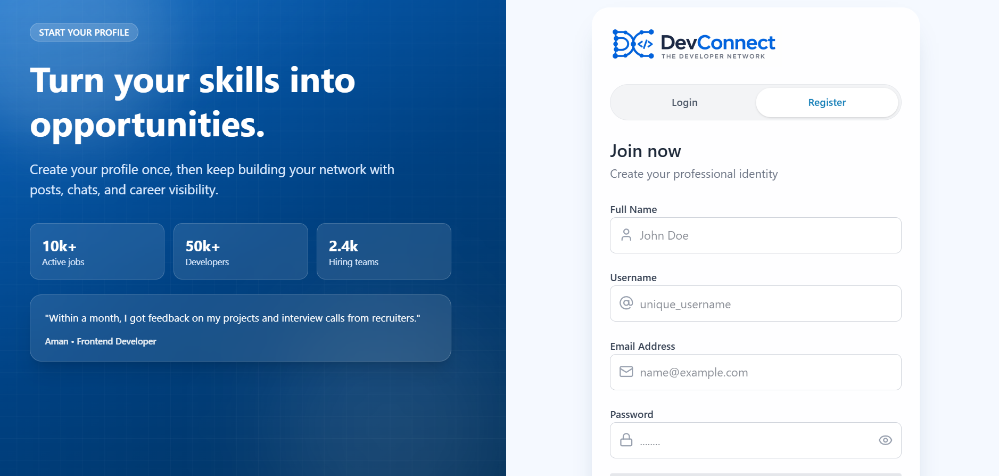
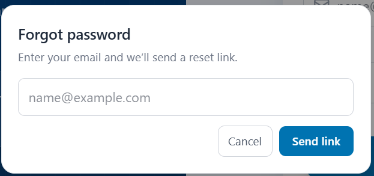
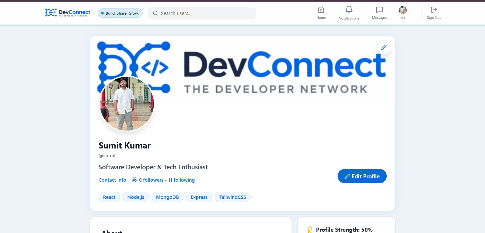
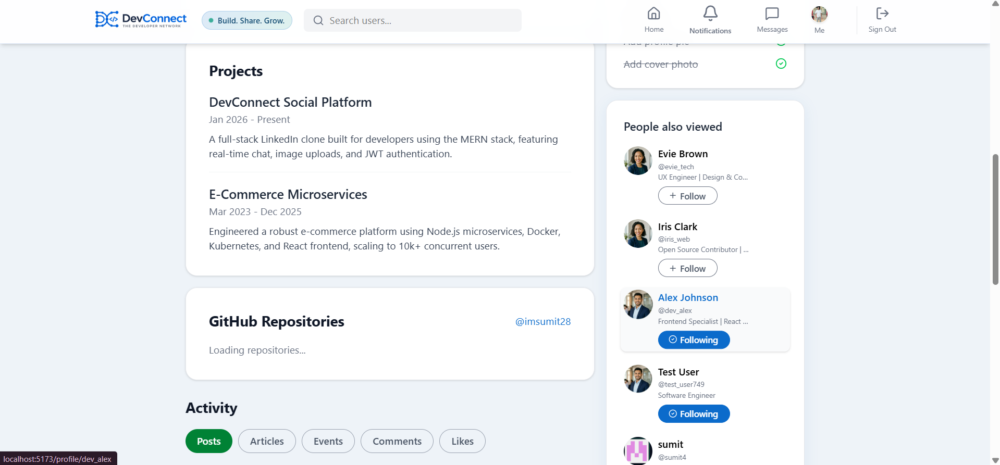
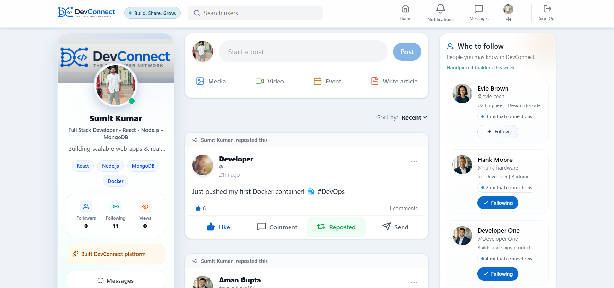
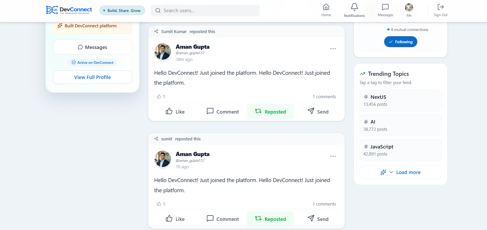

# DevConnect

DevConnect is a modern developer social network inspired by LinkedIn, built for engineers to share work, connect with peers, and grow careers.


## Demo

- Live App: https://devconnect2026.vercel.app/
- API Base: `http://localhost:5000/api`

## Features

- JWT auth with secure login/register flow
- Rich post system: Create posts with text, images, video, events, articles, and syntax-highlighted code snippets
- Real-time likes, comments, reposts, and notifications (Socket.io)
- Professional networking system with LinkedIn-style follow requests
- Dedicated Connections modal to manage followers, following, and pending requests
- Privacy-first networking: Must be connected to a user to view their connections
- Profile system with interactive avatar/cover image cropper and upload to Cloudinary
- Pinned posts and robust profile activity tabs
- Direct messaging with real-time delivery
- Search users by username
- Trending topic filters for feed exploration
- Responsive, modern UI with dynamic interaction states and polished animations

## Screenshots

### 1. Login Page


### 2. Register Page


### 3. Forgot Password


### 4. Profile


### 5. Profile


### 6. Home Feed


### 7. Home Feed


## Tech Stack

### Frontend
- React 19
- Vite
- Tailwind CSS v4
- React Router
- Axios
- Socket.io Client

### Backend
- Node.js
- Express.js
- MongoDB + Mongoose
- Socket.io
- JWT + bcrypt
- Multer + Cloudinary

## Quick Start

### Prerequisites
- Node.js 18+
- MongoDB (local or Atlas)
- Cloudinary account

### 1. Clone
```bash
git clone https://github.com/yourusername/devconnect.git
cd devconnect
```

### 2. Setup backend
```bash
cd server
npm install
```

Create `server/.env`:
```env
MONGO_URI=your_mongo_uri
JWT_SECRET=your_jwt_secret
CLOUDINARY_CLOUD_NAME=your_cloud_name
CLOUDINARY_API_KEY=your_api_key
CLOUDINARY_API_SECRET=your_api_secret
CLIENT_URL=http://localhost:5173
```

### 3. Setup frontend
```bash
cd ../client
npm install
```

### 4. Run app
```bash
# Terminal 1
cd server
npm run dev

# Terminal 2
cd client
npm run dev
```

Open `http://localhost:5173`.

## Project Structure

```text
devconnect/
  client/
    src/
      components/
      context/
      pages/
      services/
      utils/
  server/
    controllers/
    middleware/
    models/
    routes/
```

## License

MIT
